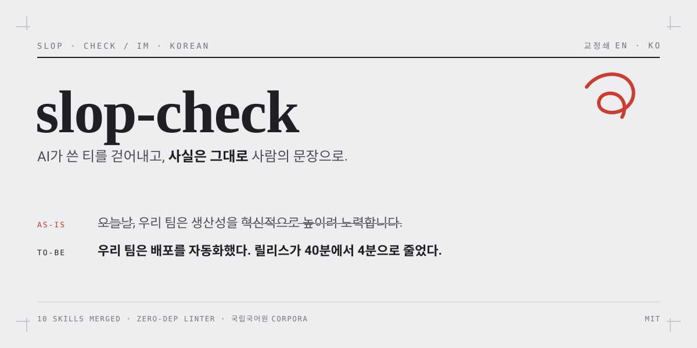
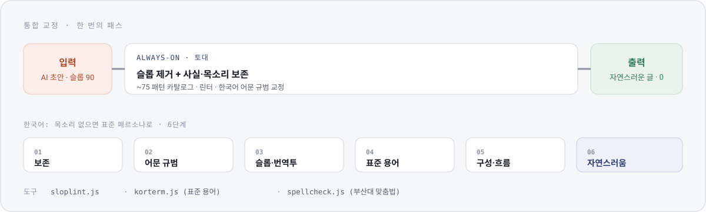

<p align="center">
  
</p>

<p align="center">
  
  
  
  
</p>

# slop-check · IM-KOREAN

프로젝트가 만들어 내는 모든 산출물(문서 · README · 커밋 · 코드 주석 · 에이전트 답변)에서 **AI가 쓴 티(슬롭)를 걷어내는** 스킬입니다. 한국어는 여기에 더해 **어문 규범(맞춤법 · 띄어쓰기 · 높임 · 조사 · 호응) · 표준 용어 · 표준 문체**까지 한 번의 패스로 교정합니다.

핵심 원칙은 두 가지입니다. **사실과 목소리는 한 글자도 바꾸지 않습니다.** 그리고 **점수 · 검사기 · API 결과는 근거일 뿐, 판정이 아닙니다.** 지킬 저자 목소리가 없는 생성물은 밋밋하게 두지 않고 신문 코퍼스로 보정한 표준 문체로 만듭니다.

열 개의 오픈소스 안티슬롭 스킬을 하나로 합치고, 국립국어원 코퍼스로 규칙을 실측 보정했습니다.

## 설치

**Claude Code 플러그인 마켓플레이스 (권장)**

```
/plugin marketplace add onam2518/slop-check
/plugin install slop-check@slop-check
```

새 세션에서 `/slop-check`, 또는 자연어로 "검수해줘 · 교정해줘 · 슬롭 제거해줘". 대량 작업은 `IM-KOREAN` 에이전트에 위임합니다.

**클론 + 전역 심링크 (모든 프로젝트에서 사용)**

```bash
git clone https://github.com/onam2518/slop-check.git
ln -sfn "$(pwd)/slop-check/skills/slop-check" ~/.claude/skills/slop-check
ln -sfn "$(pwd)/slop-check/agents/IM-KOREAN.md" ~/.claude/agents/IM-KOREAN.md
```

키가 없어도 핵심(슬롭 제거 · 규범 카탈로그 · 린터)은 모두 동작합니다. 외부 도구는 선택이며, 아래 [도구](#도구)를 참고하십시오.

## 왜 이 도구인가

영어권 휴머나이저는 한국어에 약합니다. 그리고 대부분의 도구는 슬롭만 지우고 밋밋하게 둡니다. 이 도구는 세 가지가 다릅니다.

- **이중 언어.** 영어 슬롭 카탈로그(~75 패턴)와 한국어 번역투 · 어문 규범을 함께 다룹니다. "AI 기술을 통해 효율을 높일 수 있다"는 "AI로 효율을 높인다"가 됩니다.
- **전체 교정.** 문법만 고치고 흐름이 어색하거나, 슬롭만 지우고 조사 · 호응이 틀린 채 두면 목표 미달입니다. 한국어는 여섯 단계를 한 번에 거칩니다.
- **실측 보정.** 규칙이 감이 아닙니다. 사람 문장 길이, 연결어미 · 종결 분포, 오탐률을 국립국어원 코퍼스로 측정해 규칙에 반영했습니다.

## 4대 원칙

1. **사실 불변.** 숫자 · 이름 · 날짜 · 출처 · 직접 인용은 100% 원문 보존. 없는 사실은 지어내지 않습니다.
2. **근거 기반.** 슬롭은 뭉치로 판단합니다. 토큰 하나로 단정하지 않고, 이미 사람다운 글은 손대지 않습니다.
3. **목소리 보존, 아니면 표준 공급.** 저자 목소리가 있으면 지키고, 없으면(생성물) 표준 문체로 채웁니다. 사용자 지시가 언제나 우선입니다.
4. **도구는 근거, 판정 아님.** 린터 점수 · 맞춤법 후보 · 용어 조회는 참고이며, 자동 치환하지 않습니다.

## 어떻게 동작하나

<p align="center">
  
</p>

슬롭 제거와 사실 · 목소리 보존이 **항상 켜진 토대**입니다. 그 위에서, 저자 목소리 유무로 두 갈래가 갈립니다.

| 모드 | 언제 | 무엇을 |
|---|---|---|
| **보존** | 진짜 저자 목소리가 있음 (개인 블로그 · 오피니언 · 저자 샘플) | 개성을 지킨다. 과잉 교정은 실패 |
| **표준 페르소나** | 목소리가 없음 (AI 생성물 · 보일러플레이트, 주 대상) | 신문 코퍼스로 보정한 표준 문체로 만든다 |

한국어 통합 교정은 여섯 단계입니다. 보존, 어문 규범, 슬롭·번역투, 표준 용어, 구성·흐름, 자연스러움 순서입니다.

## 구성

| 구성 요소 | 무엇 |
|---|---|
| `skills/slop-check/SKILL.md` | 진입점. 원칙(2대 약속 · Hard rules · 표준 페르소나 stance) · 모드 · 카탈로그 · 라우팅 |
| `references/` (12) | 영어 카탈로그, 한국어(패턴 · 규범 · 용어 · 실측 기준선), 표준 페르소나, 보존, 코드 · 에이전트 답변 · 작문 시스템 |
| `rules/slop-rules.json` | 린터가 읽는 어휘 · 규칙 (EN · KO) |
| `bin/` (3) | 무의존성 린터 + 표준 용어 API + 맞춤법 검사 클라이언트 |
| `agents/IM-KOREAN.md` | 스킬을 별도 컨텍스트에서 돌리는 위임 에이전트. 문서 전체 · 폴더 감사 · 대량 |

## 표준 페르소나 (신문 실측)

목소리 없는 생성물의 기본 문체입니다. 국립국어원 신문 말뭉치 표본(약 86만 문단)에서 측정한 값으로 기본값을 고정했습니다.

| 항목 | 표준 |
|---|---|
| 목적 연결어미 | `~기 위해` 계열 (구어 `~려고` 대비 11.6 : 1) |
| 종결 | 문어 평서 `~다` (합쇼체 `~습니다`는 공지 · 안내 register) |
| 문장 길이 | 중앙값 16어절, 대략 7~30 밴드 |
| 표기 | 한국어 산문은 굽은따옴표가 표준. em dash · 이모지 라벨 불릿 없음 |

사용자가 register나 톤을 지정하면(예: "구어체로", "더 캐주얼하게") 표준 대신 그것을 따릅니다.

## 도구

```bash
node bin/sloplint.js score   <파일>     # 0~100, 낮을수록 사람 글 (목표 < 25)
node bin/sloplint.js analyze <파일>     # 걸린 패턴 + 줄 번호
node bin/sloplint.js scan    <폴더>     # 파일별 점수 랭킹 (--fail-above 50 = CI 게이트)
node bin/korterm.js   search "머신러닝"  # 국립국어원 표준 용어 (KLI_API_KEY)
node bin/spellcheck.js "문장"           # 부산대 맞춤법 검사 (외부 전송)
```

린터는 한글을 감지해 영어용 통계를 끄고 패턴 밀도 위주로 채점합니다. 외부 도구(용어 · 맞춤법)는 텍스트를 외부 서비스로 보내므로 민감한 내용에는 쓰지 않습니다.

## 근거

열 개의 MIT 안티슬롭 스킬을 합치고, 국립국어원 코퍼스로 보정했습니다. 상세 출처는 [`skills/slop-check/CREDITS.md`](skills/slop-check/CREDITS.md)를 참고하십시오.

- 병합 스킬 10종, 위키피디아 "Signs of AI writing", tropes.fyi, HC3
- 국립국어원 온용어 · 우리말샘 오픈 API, 첨삭 코퍼스(GWIG), 논리관계 코퍼스, 신문 말뭉치
- 부산대 · 나라인포테크 맞춤법 검사기(jhaemin/speller-api), naradesign 글쓰기 기본

## 라이선스

MIT. 병합한 원본 스킬은 모두 MIT이며, 코퍼스 데이터는 각 배포처의 공공누리 · 라이선스를 따릅니다. 코퍼스 원본은 이 저장소에 재배포하지 않았습니다.
